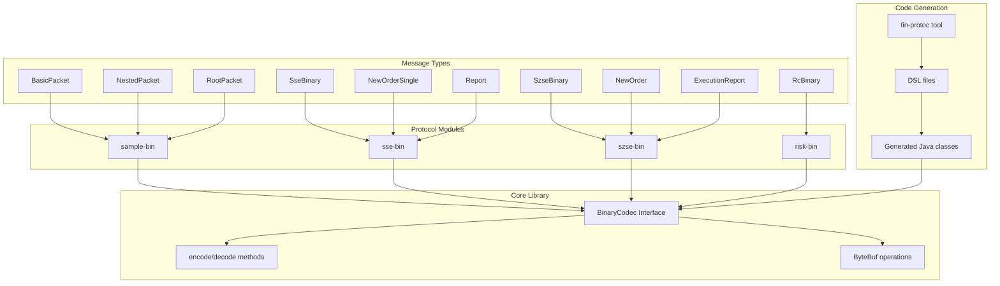
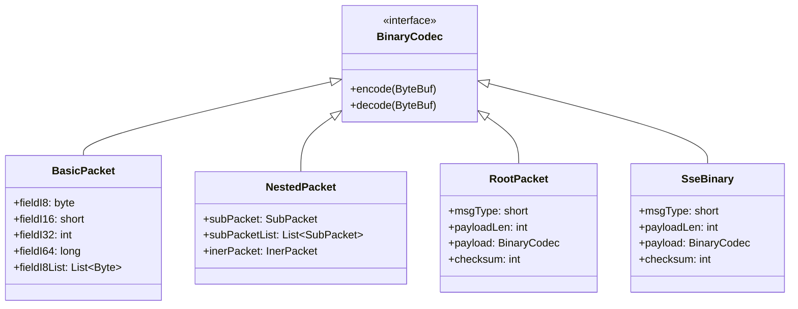
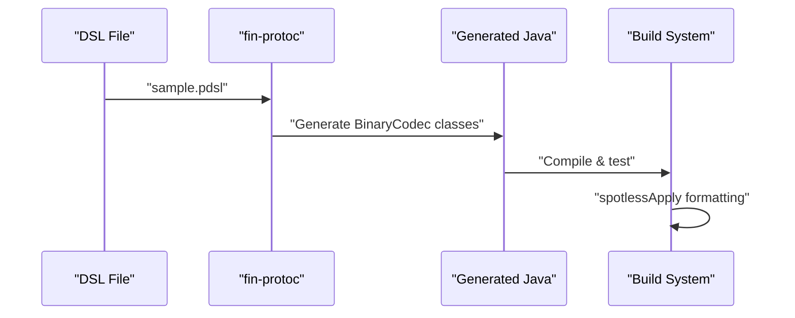

# fin-proto-java

A Java lib for financial protocol binary serialization and deserialization, supporting multiple exchange protocols including Shanghai Stock Exchange (SSE), Shenzhen Stock Exchange (SZSE), and risk management systems. [1](#0-0)

## Architecture Overview

The lib is built around a core `BinaryCodec` interface that provides standardized binary serialization capabilities for financial messages. [2](#0-1)



## Project Structure

The repository contains multiple modules, each targeting specific financial protocols:

- **codec**: Core binary codec interface and utilities [2](#0-1)
- **sample-bin**: Example implementations demonstrating framework capabilities [3](#0-2)
- **sse-bin**: Shanghai Stock Exchange binary protocol implementation [4](#0-3)
- **szse-bin**: Shenzhen Stock Exchange binary protocol implementation [5](#0-4)
- **risk-bin**: Risk management protocol implementation

## Message Type System

The framework supports various message patterns:



## Development Workflow

### Prerequisites

- Java 17 (Temurin distribution) [6](#0-5)
- Gradle 8.9
- `fin-protoc` tool installed at `~/workspace/fin-protoc/bin/` [7](#0-6)

### Build Commands

```bash
# Build all modules
make compile

# Run tests
make test

# Format code
gradle spotlessApply
```

### Protocol Generation

Each module uses DSL files to generate Java message classes: [8](#0-7)



## Continuous Integration

The project uses GitHub Actions for automated testing: [9](#0-8)

- Triggers on push/PR to main branch
- Ubuntu latest with JDK 17
- Gradle build and test execution
- Dependency caching for performance

## Message Serialization Patterns

### Basic Types

Handles primitive data types and their lists with little-endian encoding [2](#0-1)

### Nested Objects

Supports complex nested structures with recursive encoding/decoding

## Exchange-Specific Implementations

### SSE Binary Protocol

Implements Shanghai Stock Exchange binary messaging with classes like `CancelReject` [11](#0-10)

### Risk Management

Provides risk control messaging through `RcBinary` and related classes [12](#0-11)

## Notes

The framework emphasizes code generation from DSL definitions, ensuring consistency across different financial protocols while maintaining type safety and performance through binary serialization. The modular architecture allows each exchange protocol to be developed and maintained independently while sharing the common codec infrastructure.

[](https://deepwiki.com/xinchentechnote/fin-proto-java)
